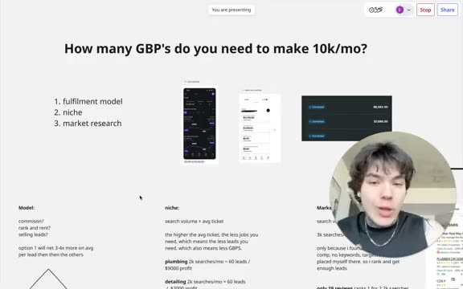
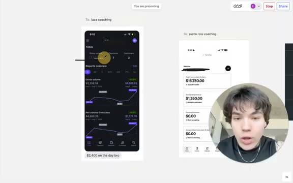
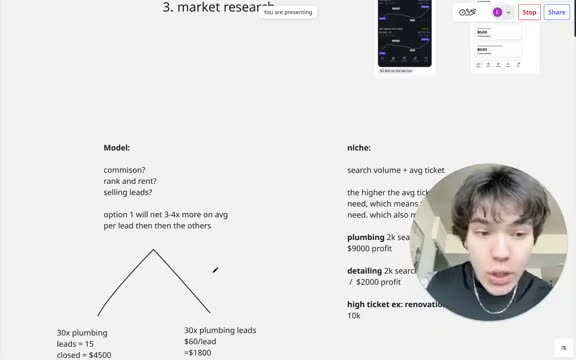
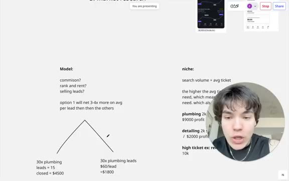
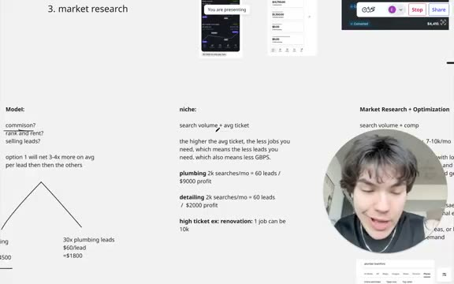
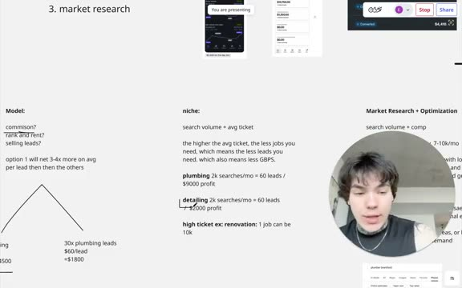
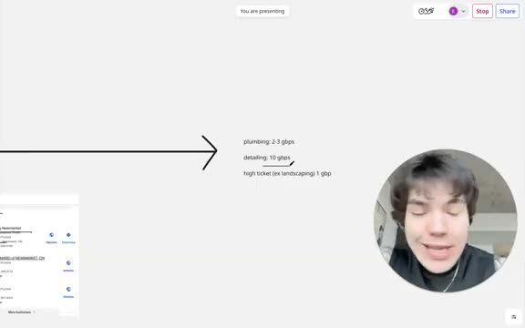
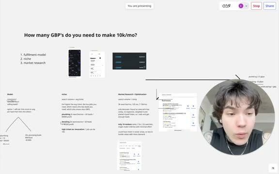

# How many GBP's Do You Need to Make $10k/mo? (Remote Service Arbitrage)

- source: <https://www.youtube.com/watch?v=-0S3VwM75BM>
- channel: Ericvelch
- uploaded: 2026-08-16
- duration: 00:12:29
- pulled by: `scripts/yt-pull.rs`

## summary

- Use Google Business Listings arbitrage with 40% commission fulfillment: earn 3-4x more per lead than $60 pay-per-lead model
- Choose niche by search volume and average job value: plumbing ($300/job) needs 2-3 listings; detailing needs 10; high-ticket services need 1 listing for $10k/month
- Reach $10k/month by ranking first for 2,000-3,000 monthly searches, converting 50% of 60 monthly leads, earning $9,000-$10,000 per optimized listing
- Research market: target low-competition areas, use exact-match keywords, establish physical address to rank above competitors with only reviews or service areas
- High-ticket services like landscaping or renovation only require one listing since single jobs yield $10k+; prioritize search volume over review accumulation when launching

## chapters

- [00:00:00](https://www.youtube.com/watch?v=-0S3VwM75BM&t=0) introduction
  
- [00:00:33](https://www.youtube.com/watch?v=-0S3VwM75BM&t=33) student examples
  
- [00:01:06](https://www.youtube.com/watch?v=-0S3VwM75BM&t=66) three key factors
  
- [00:01:38](https://www.youtube.com/watch?v=-0S3VwM75BM&t=98) fulfillment models
  
- [00:02:13](https://www.youtube.com/watch?v=-0S3VwM75BM&t=133) plumbing economics
  
- [00:03:18](https://www.youtube.com/watch?v=-0S3VwM75BM&t=198) niche selection
  
- [00:04:25](https://www.youtube.com/watch?v=-0S3VwM75BM&t=265) service comparison
  
- [00:06:01](https://www.youtube.com/watch?v=-0S3VwM75BM&t=361) market research
  
- [00:09:20](https://www.youtube.com/watch?v=-0S3VwM75BM&t=560) target numbers
  
- [00:10:28](https://www.youtube.com/watch?v=-0S3VwM75BM&t=628) niche recommendations
  
- [00:11:32](https://www.youtube.com/watch?v=-0S3VwM75BM&t=692) conclusion
  

## description

```
work with me 1 on 1 to hit $20k/mo in 60 days: https://calendly.com/velcheric/discovery-call-with-eric-calendar

if you want to get started for dirt cheap: https://www.skool.com/20kmodropservicingblueprint/about
```

- <https://calendly.com/velcheric/discovery-call-with-eric-calendar>
- <https://www.skool.com/20kmodropservicingblueprint/about>

## transcript

[00:00:00](https://www.youtube.com/watch?v=-0S3VwM75BM&t=0) So, what does it actually take to make $10,000 a month with your remote service business? I'm going to be giving you guys all the numbers and I'm actually going to give you like the tangible things to aim for so you know what inputs to do. I'm not just going to sit here and tell you theoretically this and this it depends on this and that. I am going to tell you that, but I'm also going to give you the actual numbers and things that you should try to hit so you have the right expectation and you know if you do this, this, and in this much quantity, you will get to that goal of $10,000 a month. So, over here I kind of just have a couple screenshots of a few of my students doing over $10,000 a

[00:00:33](https://www.youtube.com/watch?v=-0S3VwM75BM&t=33) month in various different industries and niches and running this in different ways. So, you can see over here, right? This is Luka over here. You can see $2,400 in a single day. Um, but as you can also see this is seven payments, right? And as you can see over here this is a $15,000 month from from Austin the last 30 days and this is again another one of my students where you can see every single invoice is a lot bigger, right? These are bigger jobs. So, it depends on a couple different factors as you can see. These are all very different service businesses that all make over $10,000 a month in profit. They just have their differences. So, the main three things

[00:01:06](https://www.youtube.com/watch?v=-0S3VwM75BM&t=66) that you need to account for is going to be the actual fulfillment model. So, what you are doing to make money off of these Google business listings, the niche that you're in, as well as the market research that you put in beforehand, right? So, these are the three factors that are going to dictate how quick and what metrics you need to actually hit in order to get to that goal. And again, at the end of the video I'm actually going to give you the exact numbers, but first start off the model. So, what do I mean by this? There is a lot of different ways that you can make money off the leads that you're generating through your Google business listings. By the way, just for

[00:01:38](https://www.youtube.com/watch?v=-0S3VwM75BM&t=98) reference, if you don't already know what I do, I essentially list Google business listings across different cities and and different services so that when somebody is looking for that service in their area, one of my listings shows up at the top. They call me, I book an appointment for my contractor to go out, he does the job, I take 40%. That's the model. But, there's multiple different ways to run this. So, that's the way that I run it, whereas some other people will list this profile and they will basically give that um that profile to a contractor on a retainer, right? So, contractor pays 2K a month, all the leads get forwarded. Or like a flat sort of uh pay per lead

[00:02:13](https://www.youtube.com/watch?v=-0S3VwM75BM&t=133) model where every single call I charge my contractor $60, for example, right? And so, the reason I do option one where I'm taking a commission is because you will make probably three to four times more on average per lead others. So, obviously that is going to bring down the amount of listings that you need in order to get to that goal. So, as an example, right? The industry that I mostly make my money in is plumbing. So, if I were to get 30 plumbing leads, I will usually close about 15 of those. So, at a 50% conversion rate, and if I'm making an average profit of $300 per job, I should be making $4,500 in

[00:02:46](https://www.youtube.com/watch?v=-0S3VwM75BM&t=166) profit, give or take, off of those 30 plumbing leads. Whereas, for example, if I was selling these plumbing leads for $60 a lead, those 30 leads will only make me $1,800. So, as you can see, obviously 4,000 is more than 1,000. Um which is why I personally recommend doing the commission model. Yes, there's a little bit more you have to actually like take your calls and close them in-house. However, this is all stuff that can be delegated and you're going to make a lot more money doing it. So, I do recommend uh running it in the commission model. Now, as far as the niche goes, there's two different things

[00:03:18](https://www.youtube.com/watch?v=-0S3VwM75BM&t=198) that you want to look out for because some niches just by nature have less search volume. There's less demand, which also means that there's less demand for that service. Of course, you're not going to be able to get as many leads, and that means each profile is not going to be have It's not going to have the same potential to make you the same amount of money. So, for example, plumbing, there's always a ton of search volume. You search up any major city plumbing, thousands and thousands and thousands of searches. Whereas, if you search up a major city and you do a more niche service, for example, like just off the top of my head, like stucco, right? That's going to be a lot more or less searches for

[00:03:52](https://www.youtube.com/watch?v=-0S3VwM75BM&t=232) for people looking to get I don't know stucco repair for example compared to a plumbing service. So, that's the first thing that matters and the second thing's going to be the average ticket because the higher the average ticket, the less jobs you need which also means the less leads you need which also means the less Google business listings. So, as an example if I'm in a city ranking first for 2,000 searches with plumbing, I can expect to get maybe two leads a day, maybe 60 leads a month and that 60 leads should convert to around $9,000 a month in profit as long as everything else is done very well and my systems are optimized. Whereas if I'm ranking

[00:04:25](https://www.youtube.com/watch?v=-0S3VwM75BM&t=265) first in an area for a car detailing service for example, we're number one just because the nature of the service itself isn't as much of like a need whereas like if somebody needs some type of plumbing work done, if they need to use the bathroom, they're not going to wait a week, right? If they need a shower with hot water, they're not going to wait a week. So, they're going to call you. They want that job done, right? Whereas something like detailing, you know, somebody wants to get their car cleaned, they don't necessarily need it today. They can wait a week. They can also shop around and find the cheapest option. They're not really in a hurry or a rush. So, you're going to have a a lower closing rate,

[00:04:57](https://www.youtube.com/watch?v=-0S3VwM75BM&t=297) right? And also the average ticket size of the job is going to be lower. So, if I'm getting, you know, 60 leads a month for plumbing, I might make $9,000 whereas if I'm getting 60 leads a month for detailing, I might only make $2,000, right? And and on the contrary if I'm doing a super high ticket service for example like a renovation, right? One job alone can make me 10 grand. So, that could be one lead, that could be five leads, that could be 10 leads, but that one job alone can make me that $10,000 a month. So, it really just does depend on the niche as well and this is not to say the higher the ticket the better because

[00:05:29](https://www.youtube.com/watch?v=-0S3VwM75BM&t=329) again you also have to account for there's usually going to be less searches for those high ticket niches so the lead volume will be less and the service itself is going to be different. So, something like plumbing, it's very quick and fast-paced whereas something super high ticket, it takes a long time to get done. The sales cycle is longer. It might be more difficult with Google to get verified. Right, detailing is one of the easiest ones. So, getting a volume of leads and a ton of those leads is actually a lot easier than getting, for example, leads in a different niche, but those leads are going to be worth less. So, again, the niche you choose itself, you have to evaluate different

[00:06:01](https://www.youtube.com/watch?v=-0S3VwM75BM&t=361) things and sort of see what fits your goals and expectations the best, and I have videos on that as well. But, the niche is going to matter a lot, too, right? And then the last thing is going to be the actual like market research as well as what you were doing on these profiles in order to maximize their results. So, this is typically going to be comprised mostly of the search volume as well as the competition in that area. All right, so I pulled up one of my profiles over here that has 120 reviews, and you can see it ranks first in the city for plumbing New Market, um which has around 3,000 searches a month, right? So, this profile with 120 reviews

[00:06:35](https://www.youtube.com/watch?v=-0S3VwM75BM&t=395) will make on on average 6 to 10k a month with like proper fulfillment and everything set up. Like me, average of 6 to 10k a month, right? But, that's only because I found an area with low competition, right? With, you know, no keywords in the competition, and I targeted, specifically, for example, you could see I targeted plumbing in New Market, right? And I was able to rank above a lot of these other businesses. A lot of these guys were listed as service areas, and I was able to get an address, which is why I was able to rank high, right? So, this profile alone makes me a lot of money, but that's only because it ranks well. And the only reason it ranks well is because I did my due diligence

[00:07:07](https://www.youtube.com/watch?v=-0S3VwM75BM&t=427) to find a good area where the competition's lacking, where a lot of the business profiles don't have addresses, where some of them aren't targeting the right keywords, um and that's the only reason I was able to rank first, right? And I pulled up another example. This profile over here with only 19 reviews is ranking above these guys with 500 plus, right? And the reason is because, again, just keyword targeting, right? I searched Plumber Brantford, and his business profile is literally Plumber Brantford, uh like exact exact match to what my search is. So, that's going to be, you know, a reason why this profile ranks first, and this ranks first for 2.2 thousand

[00:07:41](https://www.youtube.com/watch?v=-0S3VwM75BM&t=461) searches. So, with minimal effort, this profile might make this guy, you know, five or six thousand dollars a month, right? And so, there might be areas where with only like 500 searches, you can easily rank first for, right? And obviously with those 500 searches a month, you're not going to be able to make a ton of money, but you'll be you'll be able to make money easier. So, having a volume of these profiles, it might be easier to have 10 of those than one that ranks first for 5,000 searches a month, right? It genuinely might be as long as you're, you know, able to verify them and and you're good at that. Um but

[00:08:14](https://www.youtube.com/watch?v=-0S3VwM75BM&t=494) it really just depends on the numbers and you have to see what makes the most sense, right? Now, this is obviously a really, really good area with 19 reviews. If you're ranking first for 2.2,000 searches, you're getting a good amount of call volume and very minimal effort, right? Getting 19 reviews is not hard. All the SEO stuff is usually kind of what you want to make sure that you're able to compete against. Um and most of the time it's pretty easy because you're competing against blue-collar guys who don't really know anything about marketing. So, if you watch my videos, you already literally just completely just will will be easy will be easily able to rank first. Um so, this matters a lot, right? This

[00:08:47](https://www.youtube.com/watch?v=-0S3VwM75BM&t=527) matters a lot. How many searches are in that area is going to dictate it, how the competition looks like, how hard it is going to be to rank there, right? Because again, you might need 10 profiles to get enough searches to hit that 10k a month goal, and you might only need one, but maybe those 10 profiles are easier to rank than that one would be, right? So, so those all kind of matter. And these are the three main components that are going to dictate how difficult it is to get to 10k a month and also what numbers you want to look for and what you actually want to hit. Now, as far as the actual numbers go, so you know how many profiles you need to do. If you watch my

[00:09:20](https://www.youtube.com/watch?v=-0S3VwM75BM&t=560) videos and you actually do everything properly the way I say it, and if you do your due diligence, right? You choose one of these niches. These are kind of like my favorite, the easiest niches that I recommend most of my students that are doing, and you're from 10 to 50k a month or are in these niches. So, um if you are actually listening to my videos and you do your market research and you do your optimizations and you're not lazy with answering your phone and whatnot, here's what you can expect, right? So, if you're doing plumbing, two to three Google Business Listings should get you to that 10K a month in profit goal. You should be averaging around $300 per plumbing job. And so, this will amount to around 30 jobs a month, around

[00:09:55](https://www.youtube.com/watch?v=-0S3VwM75BM&t=595) 60 leads. So, as long as you can rank for around 2 to 3,000 searches conservatively and actually rank first, you will be there and you'll be able to make that 10 grand a month again and provided you're answering your phone, blah blah blah. Now, for detailing, if you want to hit that 10K a month goal, you would probably need around 10 Google Business Listings. Now, again, this is a a little bit more of a volume game and so, the review counts are going to differ a lot. A lot of it is kind of just based on the proximity to the specific area and what searches are are looking like in that specific area. All right? Because this is they're

[00:10:28](https://www.youtube.com/watch?v=-0S3VwM75BM&t=628) just so incredibly easy to verify so that doing the volume game honestly makes a lot more sense for something like detailing, but 10 profiles alone will easily be able to get you to that 10K a month mark and I'd recommend probably 25 to 35 reviews per profile. Again, if you need help with getting reviews, just watch my other videos. I teach you exactly how you'd be able to get hundreds of reviews a day. And then the last sort of like a higher ticket niche, something like that, like landscaping, one Google Business Listing is plenty, right? I know Cole over here, like he's booked hundreds of thousands of dollars in revenue every single month just off of two business profiles

[00:11:01](https://www.youtube.com/watch?v=-0S3VwM75BM&t=661) because these jobs are going to be a lot higher ticket so you don't need a lot of leads every time you close a job. You might make a lot of money, several thousands of dollars. So, this is kind of just a general guideline of what you want to look out for just so you also have the expectations on what numbers you need in order to hit to hit that 10K a month mark. Might two to three plumbing GMBs, perfectly optimized and everything set up properly with good fulfillment, 10 detailing ones or one landscaping one. That or anything really high ticket that's able to rank and has a good amount of search volume. That's pretty much the numbers that you want to

[00:11:32](https://www.youtube.com/watch?v=-0S3VwM75BM&t=692) look out for. And yeah, I hope that uh I hope that helps and I hope that gives you guys some more clarity on what you should specifically be doing and kind of what to aim for. Um and so yeah, if you like the video, then subscribe and like. If you have any questions, just drop it in the comments. I'll get back to uh all of you guys in there. And uh if you're interested in working with me one-on-one, kind of like these guys over here to scale your remote service business to 20K a month within the next 2 to 3 months, schedule a call with me. It's going to be the first link in the description. I'll basically run you through exactly how I was able to help 40 plus people in the last 8 months hit 10K a month with this

[00:12:04](https://www.youtube.com/watch?v=-0S3VwM75BM&t=724) and also basically exactly how I will literally force you to hit 10K a month to 20K a month. That's kind of the goal. I'm going to force you. I'm going to do everything with you and for you. So, schedule a call with me if you're interested in that. First link in the description. Aside from that, I have a school community. Pretty much just teach this for dirt cheap, specifically in the lower ticket niches like detailing. Um so, if you're interested in that, second link in the description. And then, I think that's it. Like, subscribe. Appreciate you guys all for watching and I'll see you all in the next one.

