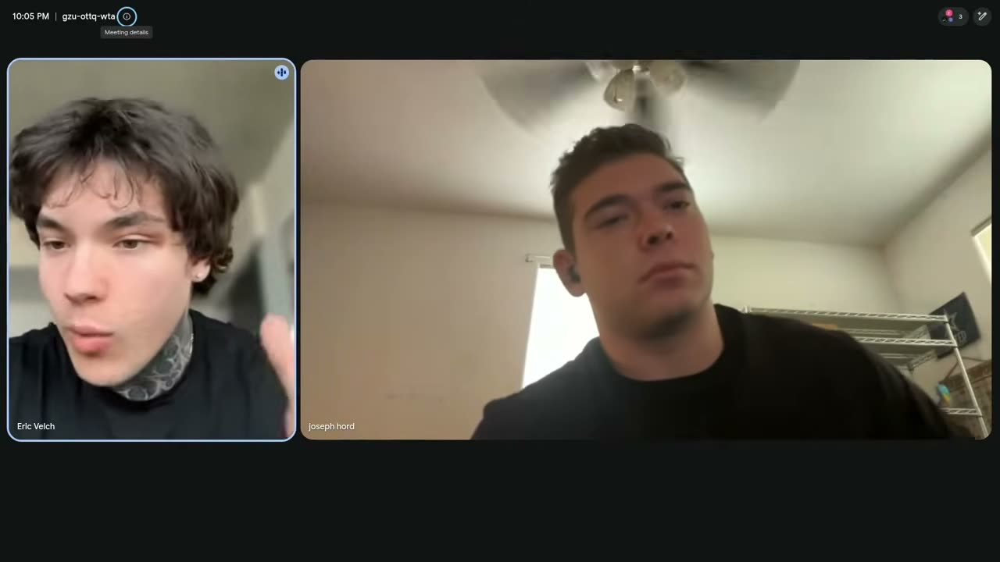
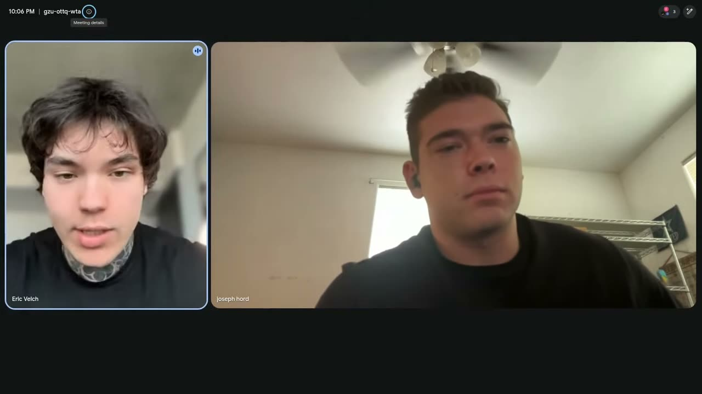
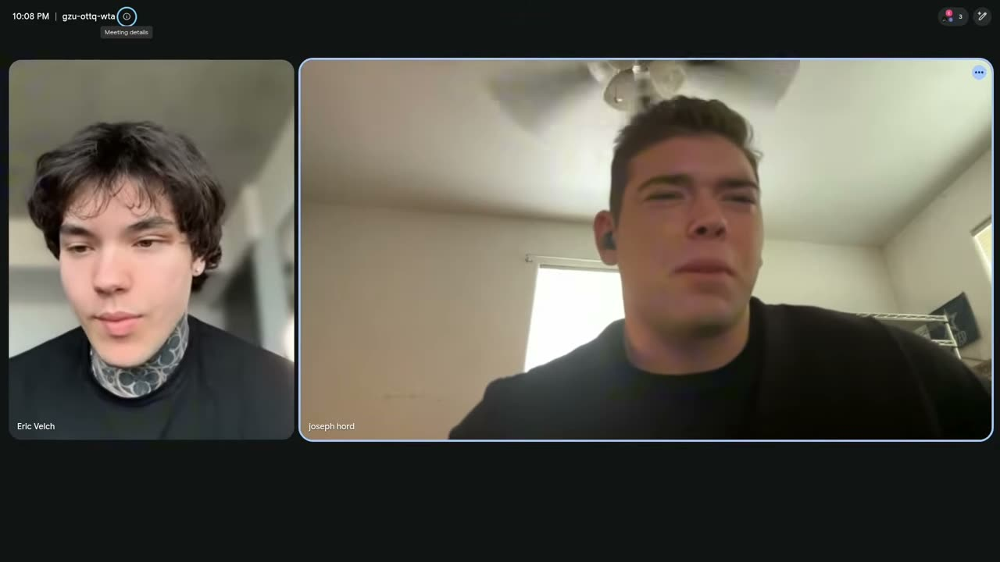
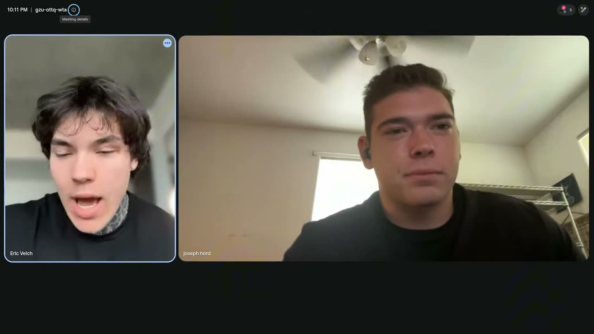
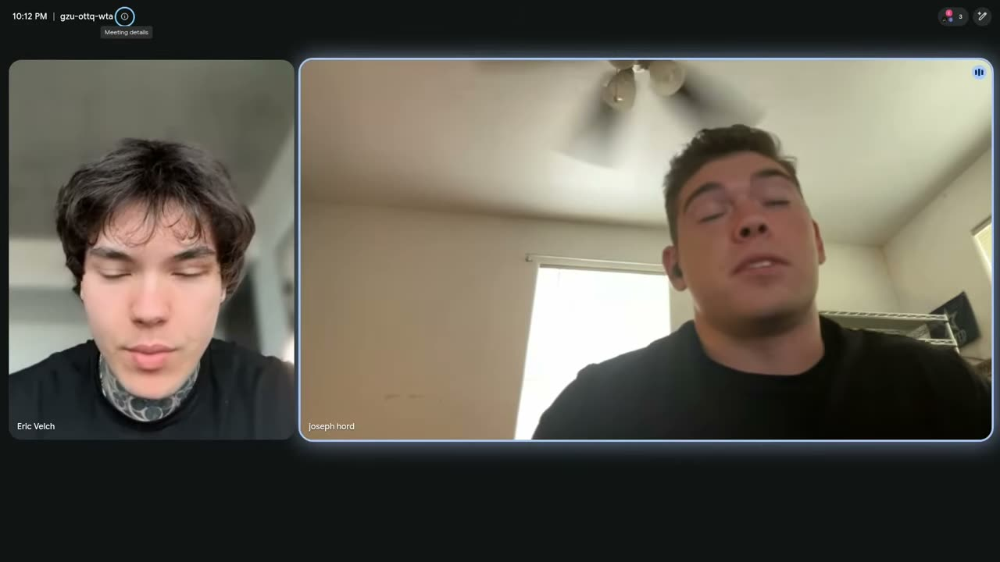
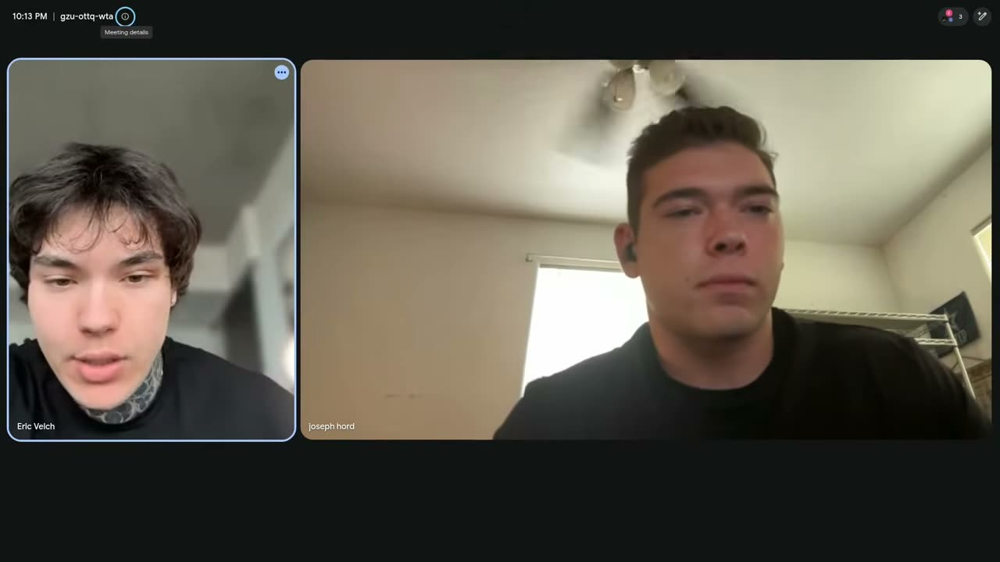
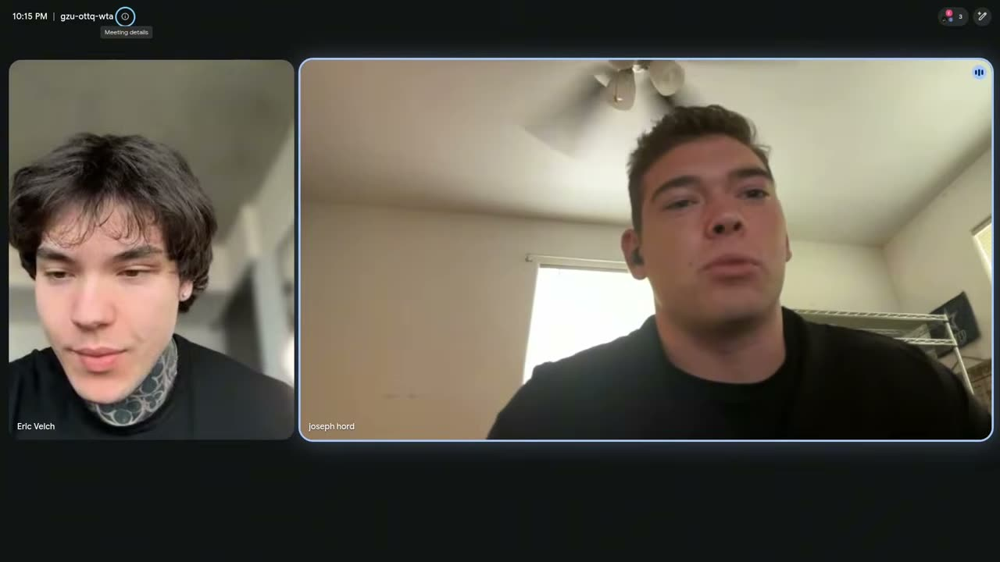
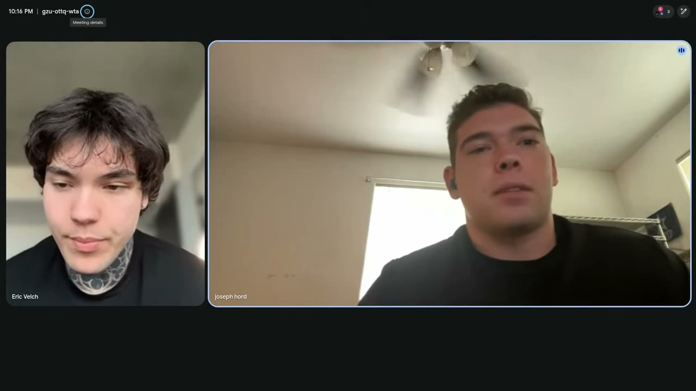

# How Joseph Sold his Service Arbitrage Business for $100k 2 Months After Starting

- source: <https://www.youtube.com/watch?v=0D4Jo7QrVNw>
- channel: Ericvelch
- uploaded: 2026-08-10
- duration: 00:15:30
- pulled by: `scripts/yt-pull.rs`

## summary

- Scaling a pool cleaning service from $4,000 to $9,000/month in two months using organic Google Business Profile lead generation instead of paid Facebook ads
- Achieving 2–3 qualified calls daily with 80% conversion to $250–$300 recurring monthly customers at 70–75% profit margins
- Selling the $9,000/month business for $100,000 by transferring customer contracts via pool route brokers while retaining the Google Business Profile
- Repeating the cycle: the lead-generating profile continues producing new customers for the next sales cycle

## chapters

- [00:00:00](https://www.youtube.com/watch?v=0D4Jo7QrVNw&t=0) introduction
  
- [00:00:31](https://www.youtube.com/watch?v=0D4Jo7QrVNw&t=31) joseph's results and timeline
  
- [00:01:41](https://www.youtube.com/watch?v=0D4Jo7QrVNw&t=101) switching to google profiles
  
- [00:03:20](https://www.youtube.com/watch?v=0D4Jo7QrVNw&t=200) daily performance metrics
  
- [00:04:27](https://www.youtube.com/watch?v=0D4Jo7QrVNw&t=267) customer acquisition process
  
- [00:05:32](https://www.youtube.com/watch?v=0D4Jo7QrVNw&t=332) setting up recurring revenue
  
- [00:06:37](https://www.youtube.com/watch?v=0D4Jo7QrVNw&t=397) profit margins and valuation
  
- [00:07:44](https://www.youtube.com/watch?v=0D4Jo7QrVNw&t=464) selling through brokers
  
- [00:08:49](https://www.youtube.com/watch?v=0D4Jo7QrVNw&t=529) what transfers in sale
  
- [00:09:57](https://www.youtube.com/watch?v=0D4Jo7QrVNw&t=597) repeat model strategy
  
- [00:11:02](https://www.youtube.com/watch?v=0D4Jo7QrVNw&t=662) community support benefits
  
- [00:12:07](https://www.youtube.com/watch?v=0D4Jo7QrVNw&t=727) advice for potential starters
  

## description

```
work with me 1 on 1: https://calendly.com/velcheric/discovery-call-with-eric-calendar

learn more about what i do: https://youtu.be/D-ahf91TjCM?si=r8xJlFtICMZwJwkp

start for dirt cheap: https://www.skool.com/20kmodropservicingblueprint/about
```

- <https://calendly.com/velcheric/discovery-call-with-eric-calendar>
- <https://www.skool.com/20kmodropservicingblueprint/about>
- <https://youtu.be/D-ahf91TjCM?si=r8xJlFtICMZwJwkp>

## transcript

[00:00:00](https://www.youtube.com/watch?v=0D4Jo7QrVNw&t=0) What's going on everybody? Another student interview for you guys. Today we have Joseph. He just sold his pool cleaning business for over $100,000. We literally started working together just over 2 months ago. He scaled this business up to $9,000 per month and is now getting rid of it for $100,000. Literally within the span of 2 months, starting completely organic all through GMBB profiles. So, we're going to be talking to him today. He's going to be going over exactly how he did this, answering some questions that you might have, and giving you all some tips if you wanted to do the exact same thing

[00:00:31](https://www.youtube.com/watch?v=0D4Jo7QrVNw&t=31) for yourself. All right, everybody. We've got Joseph here. Joseph, if you can introduce yourself briefly and tell everybody uh how much money your business was actually making before you sold it and also how much you sold it for. >> Okay. Yeah, Joseph, I doing a pool cleaning business and it was doing 9,000 a month. and I'm selling it for like right over 100,000. Um, originally whenever I first joined it was doing like 4,000 a month and so

[00:01:06](https://www.youtube.com/watch?v=0D4Jo7QrVNw&t=66) actually was bringing down so at 4,000 a month it would have sold for like 45,000 and now it's gonna sell for like right over 100. So >> that's pretty good. and and before you were doing so just some timelines. You started running this pool cleaning business how long ago? >> Like right around two years ago. >> Right around two years ago. And over the span of those two years, you got it up to around 4,000 a month. When did you uh when did you join the program? >> Uh I think like exactly two months ago or maybe like two months in a couple

[00:01:41](https://www.youtube.com/watch?v=0D4Jo7QrVNw&t=101) days ago about >> Yeah. So, so yeah, we were able to scale this and and again, just to clarify for everybody, this was all organically through Google, correct? >> Yeah, >> there you go. And um so yeah, I guess joining into this was around two months ago now. What uh what made you like I guess what what made you want to implement this into your business? And I guess like what what made you think that this this is something that would actually work and and be the thing you need to scale the business? >> Yeah. So, what I was doing before was like just doing like Facebook and meta ads and then I would just spend like a

[00:02:14](https://www.youtube.com/watch?v=0D4Jo7QrVNw&t=134) bunch of money on there. But to be honest, like I was like I was not doing well at all. Like to get a person like signed a monthly like I don't know. I've tried everything on Facebook ads and the best I could do is like eight or $900 to get someone signed on monthly that's going to pay like only 250 bucks a month. And so I looked at like doing Google ads and stuff and that led me to doing Google business profiles. Then just going down that rabbit hole. And then I came across your YouTube and I started doing the stuff

[00:02:47](https://www.youtube.com/watch?v=0D4Jo7QrVNw&t=167) that you did on there and saw like pretty instant progress to be honest. And then joined your school like the the lower membership one >> and got even more like game from that pretty much. and then joined your one-on-one and then like way went up. >> Yeah. How how long did it take you to make your first how long did it take you to get your first business profile up and then also how long it took you to make like your first dollar from that business profile? >> Um

[00:03:20](https://www.youtube.com/watch?v=0D4Jo7QrVNw&t=200) like 3 days and I mean maybe a week to maybe a week to get my first person. >> Yeah. Yeah. And >> maybe I can't remember to be honest. >> Yeah. fair able to tell that off for for the 100k. How how much was that one profile bringing in for you? >> Um, let me check. >> Like how many calls and stuff? >> Yeah, like how how many calls would you say? And yeah, I guess on a on a daily basis. >> Probably like

[00:03:54](https://www.youtube.com/watch?v=0D4Jo7QrVNw&t=234) two to three calls a day. >> Two to three calls a day. And I guess just like for some people who are thinking about running this model for like the pool the pool cleaning business side of things, what would you um I guess give give people a brief sort of understanding of it cuz a lot of um a lot of people watching have like, you know, they're they're not sure what niche they want to get into, whether it's plumbing, something where it's like more one-off jobs or something more recurring. So I guess if if you can just give some people a little bit of like an expectation of say someone calls your Google business profile, how it goes

[00:04:27](https://www.youtube.com/watch?v=0D4Jo7QrVNw&t=267) from there, how much money you make per customer, how much you know you get from a monthly recurring sort of standpoint. Kind of just give everybody a run through. >> Okay. Yeah. I mean basically I mean it's pretty simple to be honest. like whenever they call like I just like hey give me your address and I'll go out there and um give you a price on cleaning your pool what it would be which I mean like if you have someone that you're paying to do it anyway just be like hey go out there and tell me what you would charge to go clean this

[00:05:00](https://www.youtube.com/watch?v=0D4Jo7QrVNw&t=300) pool I mean if you have people also if you have people that you uh or if you're having people like in your area just asking for like quotes over the phone, too. Not saying I did this, but you could just look up what houses are for sale around you and are vacant and look up the size of the pool and then just send them to a random vacant house for sale and ask what they would charge to clean that to get an idea of what it costs to clean a pool in your area. >> Okay, fair enough. Fair enough. And so,

[00:05:32](https://www.youtube.com/watch?v=0D4Jo7QrVNw&t=332) so somebody calls, customer calls, and then you either will go out or you'll have your person who works for you go out to do the quote. How does it go from there? How do you get them on like recurring? How how does that whole structure look like? >> Yeah, pretty much just like say they're charging like 250 to 300 bucks a month or if the guy says that he's going to clean it for 150 bucks a month, then you just tell them like, "Hey, I'll charge you 250 bucks a month." Um, blah, this is what it includes. It would completely clean your pool, so you don't have to

[00:06:04](https://www.youtube.com/watch?v=0D4Jo7QrVNw&t=364) mess with it at all. Blah blah blah. And they're like, "Okay, sounds great. send you they send you their email and you just pretty much send them a service agreement like basically just pretty simple like you agree to pay this much per month. You know, we're charge you on the first of the month, blah blah blah. Enter your credit card details and it goes into effect on this date or whatever and it's cancelable at any time. Like pretty simple. Um yeah, I mean it's pretty simple. What what's the conversion rate there

[00:06:37](https://www.youtube.com/watch?v=0D4Jo7QrVNw&t=397) like you get three calls a day how much how many of those people actually end up becoming like a recurring customer? >> Um it depends. So whenever I was doing on meta I think just because it's like such low intent maybe like one out of three. >> Yeah. >> But on Google like 80% plus. >> Yeah. >> As long as you're like to be honest I could probably just raise my prices and still get like 60 to 70%. Mhm. >> But I think in the if you're like trying to get as many as you can, it's still better to keep your percentage up

[00:07:09](https://www.youtube.com/watch?v=0D4Jo7QrVNw&t=429) because you're going to sell it like if you plan on selling it, you're going to get like maybe a 10 to 12x multiple on how much your monthly recurring revenue is. So if you get like 10 people at 250 or six people at 270, like it's better to get 10 people at 250 because you're just going to sell it for a lot more. >> Yeah. And what were your profit margins on the actual business itself? >> Like 75%. 70 75%. >> Okay, cool. Um, now as far as the actual like process of selling the business,

[00:07:44](https://www.youtube.com/watch?v=0D4Jo7QrVNw&t=464) how did you get there? Like how how did that whole process happen? Did you like post it somewhere? Did someone reach out to you? And kind of how did that process just explain explain how selling the business went? Yeah. So, for pools specifically, I think I'm pretty sure pest control is like this, too. I'm not sure about like lawn care and like that stuff, but I know for pools and pest control, it's like really really common to sell your route. So, like you could just look up like pool route brokers or pestral route brokers. Just message them, be like,

[00:08:16](https://www.youtube.com/watch?v=0D4Jo7QrVNw&t=496) "Hey, I have a pool route in this area that has this much recurring revenue. um you know, can you list it for me? And the guy that I messaged, he listed mine and I got someone within like five days, but I think they usually take a little longer to sell them that. >> Yeah. >> But like it was like if you you can just look up like pest control or pool route broker and then message them saying that you want to sell your stuff and they'll list it all for you. So like that's super simple. I tested the guy like

[00:08:49](https://www.youtube.com/watch?v=0D4Jo7QrVNw&t=529) three times and he put my stuff up for sale. >> Nice. Nice, dude. And uh kind of explain like for for that 100K, what is the buyer getting? Like what what's kind of included in there? >> So, what's actually pretty good is like they're like literally only getting the contracts. Like you're basically just transferring over the contracts. Like you don't actually give them anything to be honest. like they pretty much just goodwill. They just get goodwill with the customer which is like like for this

[00:09:24](https://www.youtube.com/watch?v=0D4Jo7QrVNw&t=564) like I think the like best thing about it is you're not selling your GMBB. So like if you like if you're getting 10 people from your Google business profile like per month or whatever and you sell that route like you're going to keep your Google business profile and you're going to get another pe 10 people the next month. So it's like you're just selling goodwill. you're, to be honest, not really selling anything tangible. >> Yeah. Yeah. So, it's kind of like rinse and rinse and repeat. Do do you plan on uh like doing this again, setting up

[00:09:57](https://www.youtube.com/watch?v=0D4Jo7QrVNw&t=597) more profiles, scaling it up, and selling it again, or what's what's the goal for you now? >> Oh, yeah. As soon as I put it up for listing to sell, I started making more profiles for it. >> Yeah. Yeah. So, is is that kind of like the main goal now? What's I guess what's the goal for you? Say like six months from now, what's the goal? I don't have a goal to be honest, but I think in the next like six months I'm I'm just going to do this again to be honest. I think like six months from now just like just cuz it's a little bit of a learning curve.

[00:10:29](https://www.youtube.com/watch?v=0D4Jo7QrVNw&t=629) >> Yeah. >> But knowing what I know now, like I could probably get another one up to sell for like 4 to 500K in the next like six months. So that's what I'm planning on doing is just this again. >> Yeah. Yeah. Um, and I guess what would you say was like the biggest thing that helped you get results so quickly? I guess just in terms of I mean I guess what I offer and like in in the program itself like what do you think was the biggest thing that helped you get results really quick? >> Yeah. So messaging you and then another

[00:11:02](https://www.youtube.com/watch?v=0D4Jo7QrVNw&t=662) big thing was like the weekly group calls and the community in school. So, like how we have everyone set up and like there's been like group calls where everyone's talking for like three hours or whatever and like tons and tons of game on there. And also like I've had message people messaged me after a group call like, "Hey, you were talking about this in the group call. Can you explain it to me more?" Like I was going through with someone on there like he was asking about what I was talking about on the call. >> Yeah. >> About like getting stuff verified

[00:11:34](https://www.youtube.com/watch?v=0D4Jo7QrVNw&t=694) through a certain way. >> Yeah. And then like I've messaged certain people also like, "Hey, I saw you made a post about this or whatever. Like can I give you a call and like ask you some questions about that too?" So I've gotten a lot of help through that also. And also like there's a quite a few people like making like real money in there too. >> Yeah. Yeah. It's always it's always good to say. I always say that people overlook the fact of like Joseph and every other person you've seen in my videos making 10, 30, 50, 100K a month. Like they're all in there and these are

[00:12:07](https://www.youtube.com/watch?v=0D4Jo7QrVNw&t=727) all people that are very helpful. We've all kind of like this is a very niche model. So there's not a lot of people who are doing this. Everyone who's doing it is in you know my group. So uh you know there's a ton of help around the board. Obviously myself included. But uh aside from the one-on-one help from me, you have a group of others. you know, dozens of guys making over 10k a month in profits. So, um, that's also another another thing. And, um, I guess Joseph, if anyone else is watching this, we'll wrap it up here. But if somebody was watching and kind of considering joining or or starting this business model or

[00:12:40](https://www.youtube.com/watch?v=0D4Jo7QrVNw&t=760) whatever it is, what do you uh what would you say to them? >> Yeah, I mean, just just start it. Like, what do you have to lose realistically? Like, I mean, it doesn't really take any money to start. I mean, just there's not really a reason to not start it because like say you say you book a call with Eric and you don't like it, then you don't pay anything. Or it's like if you join his one program, >> I mean obviously if you join it and then don't ever do anything with it, it's going to suck. But like realistically,

[00:13:13](https://www.youtube.com/watch?v=0D4Jo7QrVNw&t=793) there's no way you could go through everything in like like the worst like three months not be making like pretty good money. >> Yeah. Yeah. For sure. There you go. That's uh that's exactly sort of what uh I guess everyone is concerned about not making their ROI. I feel like people are very uh fixated on like am I going to make my money back and and whatnot. And as I always tell you, you can, you know, watch my YouTube videos and figure it

[00:13:45](https://www.youtube.com/watch?v=0D4Jo7QrVNw&t=825) out yourself. It's uh it's definitely possible. Um Joseph did in the beginning as well, right? Like we, you know, he started off just watching my free content and joined the school group and then eventually we started working together and that's when we skyrocketed. But uh yeah, I think I I think we'll leave the video there. Appreciate you, Joseph, again for hopping on. Um, and um, yeah, next videos with the 500K uh, business that we're going to sell in December. Let's go. >> Yeah, for sure. I'll let you know whenever I because I'm already getting my other stuff situated right now. So, I'll let you know whenever I sell the

[00:14:17](https://www.youtube.com/watch?v=0D4Jo7QrVNw&t=857) next one. >> Perfect. >> Yeah, this is a Yeah, you could like block out. Can you see it on mine? >> Yeah. >> Yeah, you could like block out this stuff. >> Yeah. and like [clears throat] block out this stuff too. >> Yeah. >> But yeah, this is like all the >> I think pretty much this stuff is what you're looking for. Just total consideration >> honestly just to make sure people aren't like, "Oh, this guy's bullshitting." That's it. But this this pretty much

[00:14:49](https://www.youtube.com/watch?v=0D4Jo7QrVNw&t=889) >> Yeah. Okay. Perfect, man. >> All right, guys. There you have it. Absolutely insane. If you guys are interested in working with me oneonone just like Joseph, schedule a call with me. It's going to be the first link in the description. I'll run you through exactly how I'd be helping you set something like All right, guys. There you have it. Absolutely crazy stuff. Um, and as always, if you're interested in working with me oneonone, schedule a call with me. It's going to be the first link in the description. I'll basically run you through the exact process that me and Joseph as well as all my other students use to scale our remote service businesses to the point of 20, 30, $50,000 a month and eventually sell it.

[00:15:22](https://www.youtube.com/watch?v=0D4Jo7QrVNw&t=922) So, if you're interested, schedule that call with me. It's going to be the first link in the description. Appreciate you guys all for watching. Like, subscribe, and I'll see you all in the next

