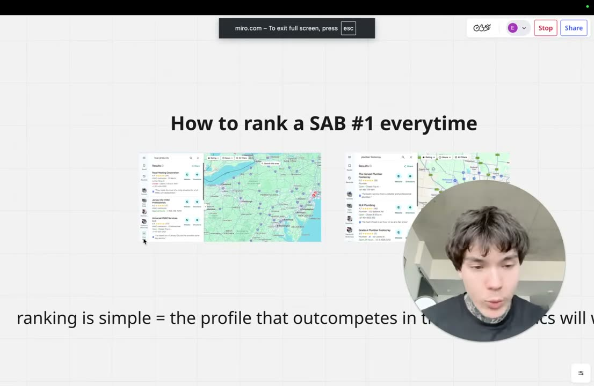
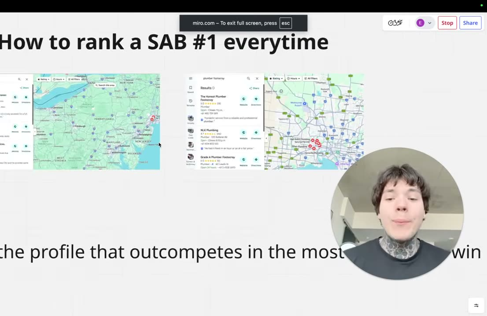
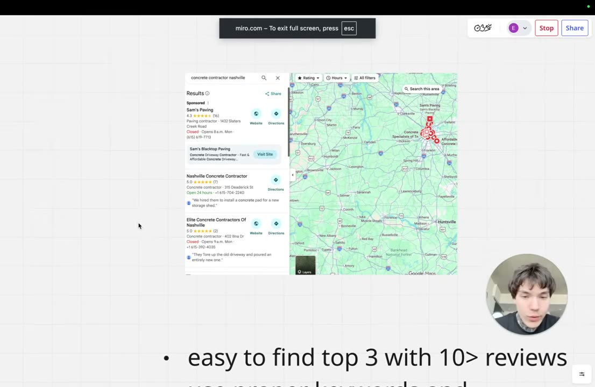

# How to Rank #1 on Google as a Service Area Business (SAB)

- source: <https://www.youtube.com/watch?v=cXAKQeNQOd8>
- channel: Ericvelch
- uploaded: 2026-09-13
- duration: 00:13:08
- pulled by: `scripts/yt-pull.rs`

## summary

- Rank #1 on Google as a service area business by outcompeting rivals on four metrics: niche selection, review volume, keyword placement, and business profile optimization.
- Prioritize high-ticket service niches or small cities where competitors have under 10 reviews and high monthly search volume (examples show $15,000–$30,000 monthly revenue potential).
- Use Semrush to identify keyword gaps in competitor profiles; target high-volume keywords like "plumber" over "plumbing" and include service plus city name in your business profile title.
- Build 10–40 reviews through structured campaigns, extend business hours beyond competitors (like 24-hour emergency services), add quality photos, and maintain consistent profile updates.
- Analyze competitor profiles for missing elements—unoptimized keywords, closed hours, AI-generated photos, stale posts—and build your profile to fill those gaps.

## chapters

- [00:00:00](https://www.youtube.com/watch?v=cXAKQeNQOd8&t=0) introduction and examples
  
- [00:00:32](https://www.youtube.com/watch?v=cXAKQeNQOd8&t=32) why address isn't essential
  
- [00:01:06](https://www.youtube.com/watch?v=cXAKQeNQOd8&t=66) competing on multiple metrics
  
- [00:01:39](https://www.youtube.com/watch?v=cXAKQeNQOd8&t=99) four ranking metrics
  
- [00:02:45](https://www.youtube.com/watch?v=cXAKQeNQOd8&t=165) niche strategy and high-ticket
  
- [00:04:23](https://www.youtube.com/watch?v=cXAKQeNQOd8&t=263) review count advantages
  
- [00:06:35](https://www.youtube.com/watch?v=cXAKQeNQOd8&t=395) keywords critical to ranking
  
- [00:08:46](https://www.youtube.com/watch?v=cXAKQeNQOd8&t=526) google business profile settings
  
- [00:10:56](https://www.youtube.com/watch?v=cXAKQeNQOd8&t=656) competitor profile assessment
  
- [00:12:02](https://www.youtube.com/watch?v=cXAKQeNQOd8&t=722) conclusion and pitch
  

## description

```
work with me 1 on 1 to hit 20k/mo in 60 days: https://calendly.com/velcheric/discovery-call-with-eric-calendar

How i hit my first $20,000 month doing this: https://www.skool.com/20kmodropservicingblueprint/about
```

- <https://calendly.com/velcheric/discovery-call-with-eric-calendar>
- <https://www.skool.com/20kmodropservicingblueprint/about>

## transcript

[00:00:00](https://www.youtube.com/watch?v=cXAKQeNQOd8&t=0) What's going on everybody? In this video, I'm going to be showing you guys how you can basically guaranteed rank number one on Google even if you have a service area business profile that does not have an address. I pulled up a couple examples here from some of my students. This is Henry who's ranking first in multiple cities as a service area business. He's making over $30,000 a month with his remote plumbing business. I actually pulled up another example over here. Uh seven reviews, very competitive area, Jersey City, as well as a very competitive niche of HVAC. Another one of my students ranking second here. So, I'm basically going to break down exactly how you can do this.

[00:00:32](https://www.youtube.com/watch?v=cXAKQeNQOd8&t=32) Now, I personally do not have any service area business profiles just because I'm able to verify any profile on any address, but if for whatever reason you do have a service area business and you need help ranking and getting more leads, this is exactly what it comes down to. And again, a lot of people do think that you do need an address that it's like the number one most important thing. Of course, it's going to help. That's again why all of my profiles are on addresses, but if you aren't able to get any address profile listed anywhere you want and you do have to opt for a service area, it's still very, very much so possible. I have a video on my channel of quite literally a

[00:01:06](https://www.youtube.com/watch?v=cXAKQeNQOd8&t=66) student, Austin, who's making over $15,000 a month in profit off of three service area business profiles um with his remote plumbing business as well. So, basically, I'm going to break this down and the number one thing and really the only thing that you need to understand is that in order to rank, it's very simple. You just need to outcompete the other profiles in your area on the most amount of metrics possible. And so, having an address is one of those metrics, but you're forgetting that there is a lot of other things. So, I've broken them down and I'm basically going to show you exactly how you can look out for these specific metrics, how you can see where your competition's lacking and what they're

[00:01:39](https://www.youtube.com/watch?v=cXAKQeNQOd8&t=99) missing so you can specifically target those things to rank in that area for that service. And this really just comes down to the niche that you're in, the reviews, the keywords, as well as the general Google business profile settings. And so, when you're looking at niches, you're always going to notice that higher ticket niches typically have lower review counts, and a lot of the time they don't have very well-done keywords, and a lot of the stuff is just lagging because a lot of these higher ticket niches aren't targeted as much for lead generation or for remote service businesses. And by the way, when I'm saying remote service businesses,

[00:02:12](https://www.youtube.com/watch?v=cXAKQeNQOd8&t=132) this is what I do. I basically run a plumbing company where I have business listings in different areas. People call my listing, I partner with a plumber to do the work in that area, and I take 40%. So, when I reference Henry and Austin, these guys make a lot of money. They're doing the exact same business model. Um but a lot of the times in specific niches that are higher ticket, you're going to see lower review counts and just lagging things. So, if I search for a Nashville contractor and concrete contractor in Nashville, you can see the top three rankings right after the guy who's running ads. Organically, number one, seven reviews. Number two, two

[00:02:45](https://www.youtube.com/watch?v=cXAKQeNQOd8&t=165) reviews. And the guy below that probably also had a couple reviews. And so, you can easily find areas where the top three have under 10 reviews. It's It's very easy. And so, if you're just looking for an area where you can rank a profile, get leads, and contract the work to, going for a high ticket niche a lot of the times is very very easy to get leads. Um because like I'm I'm showing you right here, it's very easy to outcompete specifically on reviews. And typically, the number one thing that contractors are kind of good at is getting reviews because they have been in business for many years at this point. And so,

[00:03:18](https://www.youtube.com/watch?v=cXAKQeNQOd8&t=198) they've accumulated a lot of reviews. Right, they might suck at SEO and everything else, but reviews are a very big factor for ranking just as the addresses. Um so, even if these guys do have seven review or sorry, even if these guys do have addresses, they only have seven reviews. So, if you had a service area business profile with proper keywords, everything set up, you watch my other videos, and you do I mean, you set it up exactly how I say to set it up, you have 10 reviews on your profile, you are most likely ranking first with a service area business profile. And by the way, if you want to look at the search volume research for concrete contractors in Nashville, it is stupidly high. So, you ranking first

[00:03:51](https://www.youtube.com/watch?v=cXAKQeNQOd8&t=231) here, that profile alone can probably make you like $20,000 a month genuinely. Um so, that is just uh sort of one example if you want to run off with it as well. Um that's kind of the first thing that you want to look at is specifically if you feel like you are very weak in the department of being able to get addresses, try getting a service area for a high-ticket niche in an area where there's lower view counts and also high search volume. You can still make a ton of money and rank very well. Um so, usually you just want to look out for these areas where there's under 10 reviews on these

[00:04:23](https://www.youtube.com/watch?v=cXAKQeNQOd8&t=263) profiles and you just watch my videos and set it up properly, you will rank first. Um so, that's the first thing, the niche, and the second thing kind of tying into it is the review count. Um so, obviously the less reviews that your competition has the better and that gives you one more other thing that you can outcompete, one more metric. So, again, address aside, if you're beating them in keywords, you're beating them in review counts, right? You are very, very likely going to rank above them overall. Um and so, aside from higher-ticket niches, a lot of smaller cities and suburbs also often have lower review counts. So, I pulled up an example kind

[00:04:57](https://www.youtube.com/watch?v=cXAKQeNQOd8&t=297) of close to me in Toronto where I live. If I search for a plumber in Uxbridge, which which plumber, by the way, is one of the like highest search volume uh and most competitive niches, you can see over here, yes, higher than concrete, but still on the low end where these guys have 60 reviews, 40 reviews, 30 reviews. And this is literally a matter of a day's work. Like, getting 40 reviews on a profile is like quite literally like it's not even you could pay for 40 reviews, you could do a little bit of work and get that 40 reviews. It's very easy to get 40 reviews on your profile. By the way, for review methods, check on my page, I have

[00:05:28](https://www.youtube.com/watch?v=cXAKQeNQOd8&t=328) a ton of stuff on getting reviews. Um just watch my other videos. But, as you can see over here with 41 reviews, we have another profile that doesn't even have his hours open, right? So, completely unoptimized, the hours aren't even open, uh no keywords whatsoever, because also a lot of these smaller cities aren't targeted by lead gen people, so the keywords are usually lacking pretty pretty hard. Um so as you can see over here, this uh is clearly clearly evident in the fact that this guy with 41 reviews, no hours, and a service area business profile is ranking second over here. Um and so that is another thing that you

[00:06:02](https://www.youtube.com/watch?v=cXAKQeNQOd8&t=362) want to look for, right? You want to look for smaller cities and suburbs and even if it's a big suburb outside of a small city, you might be able to like I have a lot of my students list profiles in like suburbs that are outside of small city or outside of big major cities with a super low competition and if you know how to look, you can find these areas um which again, watch my other content for. But if you can find these areas, a lot of the time they have a very high search volume themselves. Um and so you can really find some solid ass places to list service area profiles and even if

[00:06:35](https://www.youtube.com/watch?v=cXAKQeNQOd8&t=395) they are service areas, you can rank there as long as the review counts are generally pretty low. Uh that's another thing that you want to look at. Again, keywords, this is a huge thing, right? If you're looking at your competition and they all have bad keywords, you can easily rank there. And so I pulled up another crazy example over here um because you can quite literally see, all right? If I'm searching for a plumber in Myrtle Beach, you can see the number one profile here, 39 reviews, service area business profile, okay? And the only reason this guy ranks above these two over here is because these guys just

[00:07:09](https://www.youtube.com/watch?v=cXAKQeNQOd8&t=429) have absolutely no keywords in their profiles whatsoever. Bluewater Plumbing Service, Beach Plumbing, okay? Obviously, plumbing is a keyword in itself some in some sorts, but when you look at the search volume research, you can see over here plumber gets way more volume of searches compared to plumbing. Plumbing is 320, whereas plumber's got 480, then it's got 390, then it's got 320. So it's like three or four times more searches towards the keyword of plumber. So if you were able to list a service area profile, called it Plumber Myrtle Beach, and you had 40 reviews with a five-star rating, you're 100%

[00:07:42](https://www.youtube.com/watch?v=cXAKQeNQOd8&t=462) like literally 100% going to rank first in this area for plumbing. And the crazy thing is, with 10,000 searches a month of volume, you're easily going to be pulling in multiple leads every single every single day, excuse me. Three to five leads a day is very, very doable um if you're able to actually rank in this area. So, this is like obviously just like another really crazy area that's super, super low barrier to entry with really, really good um like results that you could be getting out of it. So, again, feel free to run off with it if you'd like, but this is just another really, really good

[00:08:15](https://www.youtube.com/watch?v=cXAKQeNQOd8&t=495) example of a way and and another thing that you want to look out for is profiles that have horrible, horrible keyword usage. They don't have the service in the city in the name, which is again the most important thing, right? Check this number over here, go on semrush.com, um do your keyword research, and if the guys in the top three do not have the main keyword or anything near it in their names, in their titles, is the most important thing, then very, very good chance with a service area business, evidently, you can rank first very easily. Um

[00:08:46](https://www.youtube.com/watch?v=cXAKQeNQOd8&t=526) and so, yeah, the less the keywords, the better. So, that's the next thing, and then the last thing is just like overall Google Business Profile settings. Um and this basically is broken down into like the hours, the photos, how filled out the profile is, and whether the area in itself is service area business profile dominated, right? Because it gives you that proof of concept. If you can see over here, well, the current profile that ranks first is a service area business. The third profile that ranks third is a service area business. I can also have a service area business and rank first or third, obviously. So, that gives you some clarity, of course,

[00:09:19](https://www.youtube.com/watch?v=cXAKQeNQOd8&t=559) and just kind of gives you the proof of concept. If other service area business profiles are ranking there, then you can, of course, rank there, too. Um and the other things are just like generally how well these profiles are built out. So, as I was showing you, if these guys have closed hours, for example, or they're not working on Saturdays and Sundays, and on the weekdays it's 9:00 to 5:00 open. That's a huge barrier and like place of entry where you can basically take over free leads, right? Cuz if every other profile is closed on Sundays and from 5:00 to 11:00 p.m., say you do a plumbing

[00:09:51](https://www.youtube.com/watch?v=cXAKQeNQOd8&t=591) service, right? A lot of these emergency calls will come in later in the day or whatever. So, you're capitalizing off of people who are calling during the times that every other business profile is closed. And if every other business profile is closed, you're naturally going to rank a lot higher. Um so, that is one huge thing. Check the hours on these profiles, um and if they're, you know, have very limited clo- like open hours, then that's a just like a super super easy like low-hanging fruit that you can grab and and basically steal leads from the other profiles. So, that's the That's the first thing. The

[00:10:23](https://www.youtube.com/watch?v=cXAKQeNQOd8&t=623) other thing is just checking if that area as a whole, like as I was saying, has other service area business profiles that rank first. So, for this example over here, if I search plumb- plumber in Craigmore, you can see over here, pretty much every single profile that ranks is a service area business, aside from the first one over here. So, again, I'm not denying that having a um an address helps, but the only reason this guy is ranking first over all these guys is because these guys also suck. They just don't have any keywords. So, if this guy with 24 reviews did have proper keyword usage, then he would 100%

[00:10:56](https://www.youtube.com/watch?v=cXAKQeNQOd8&t=656) be ranking above the guy who has an address. Um so, keywords very very important, but look if that area is service area business dominated, that just gives you again that proof of concept. Um check if they have shitty photos, right? Like look into these profiles, see if they just have a bunch of garbage AI slop photos, because those convert horribly. Customers can see through that. Um and again, a lot of like lead gen sort of profiles are ran by like some dumbass dude in a third world country who doesn't know what he's doing, uh at least photos-wise. So, get some solid-looking high-quality photos, even if they are AI-generated, make them look

[00:11:30](https://www.youtube.com/watch?v=cXAKQeNQOd8&t=690) legit and real. Um and go through these other profiles, see how consistent the updates are, see when the last time they posted anything was, see how uh long ago their last review was, check the SEO on on all the other components of their profiles, and these will give you some good indicators of whether this is an area that uh you can rank against, whether these profiles are lacking a lot of different things, whether they're missing out on different things, and uh that you can indeed rank there with a service area business profile. So, that's basically everything. Of course, if you have an address and do all of

[00:12:02](https://www.youtube.com/watch?v=cXAKQeNQOd8&t=722) these things, you're unstoppable, but these are the the four main metrics aside from having the address that you want to look at to basically validate whether you can rank. And once you do validate that you can be and outcompete these other companies in one, two, or three of these aspects, then you most likely will be able to rank above the ones with an address. So, that's basically everything for this video. If you enjoyed it, like and subscribe. And if you're interested in working with me one-on-one to start your remote service business, scale that to $20,000 a month within the next 60 days, schedule a meeting with me. I'll run you through

[00:12:34](https://www.youtube.com/watch?v=cXAKQeNQOd8&t=754) exactly how I did this, how I've helped over 40 people hit 10K a month doing this, um and can basically do the same for you. So, if you're interested in that, scale, uh sorry, in in scaling your remote service business, book a My My brain's fried. Book a call, first link in the description. Also, if you want to just list a bunch of profiles for your business, whether you want to just have a bunch of address listings for your company, or whatever it might be, if you need Google Business Profile help and you just want a bunch of locations with reviews, schedule call with me. I can also help you there. Uh I also have a school community if you're interested, second link in the description. Aside from that, appreciate you guys all for watching. Like,

[00:13:05](https://www.youtube.com/watch?v=cXAKQeNQOd8&t=785) subscribe, and I'll see you all in the next one.

